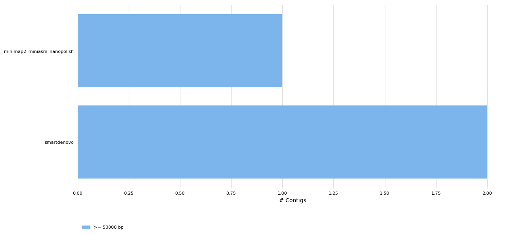
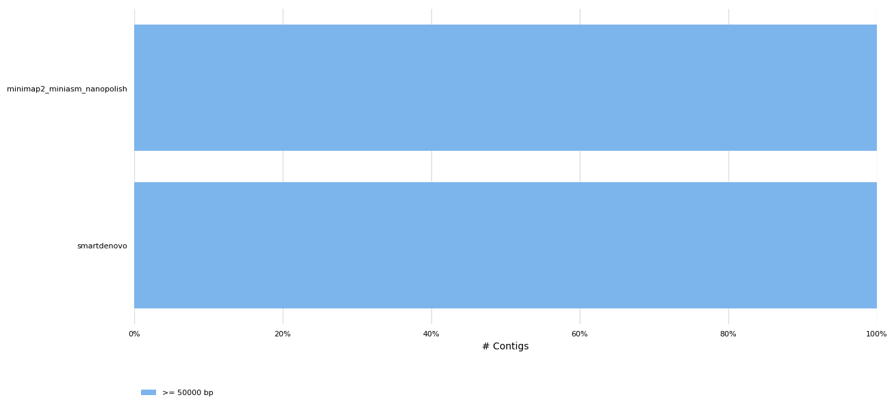
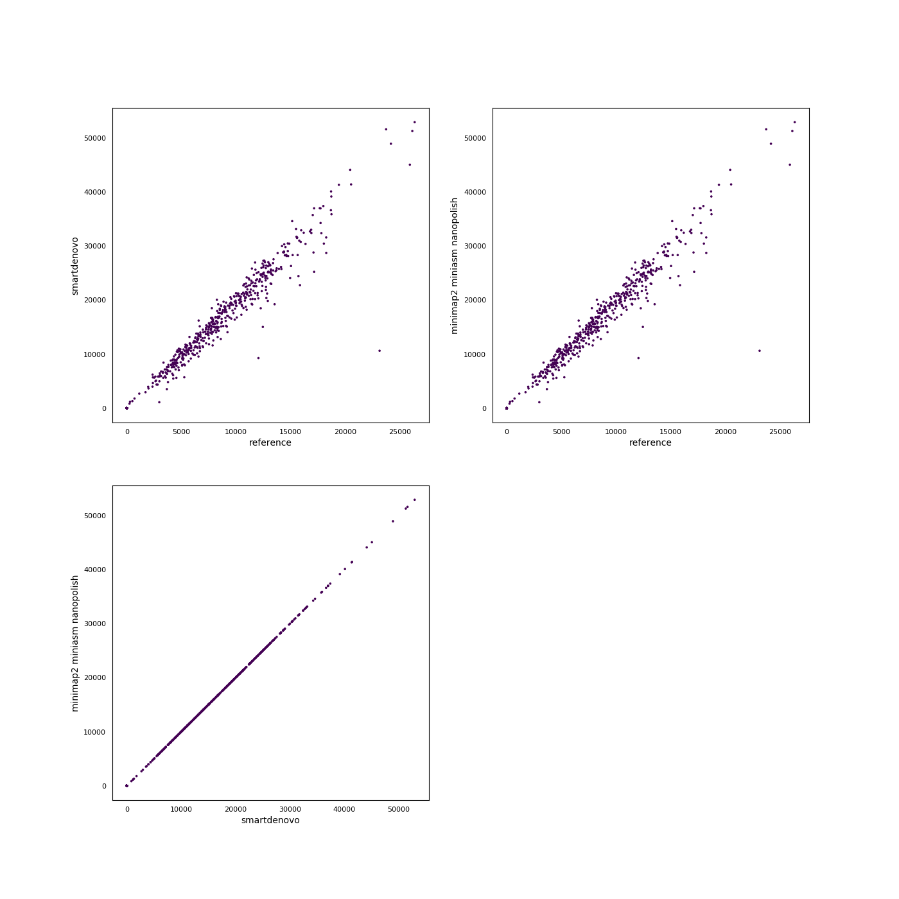
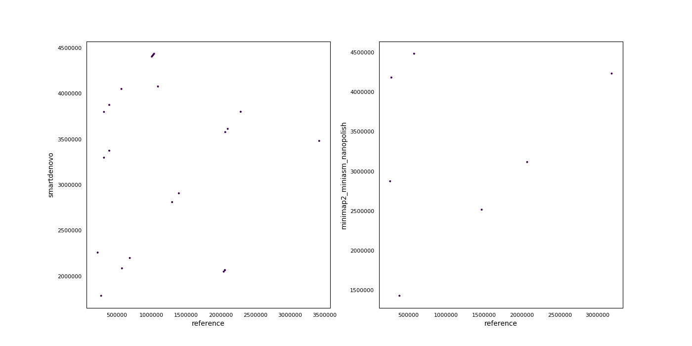

# Assembler benchmark for ONT MinION data
#### Authors: Carlos de Lannoy, data from data from [Loman Labs](http://lab.loman.net/2017/03/09/ultrareads-for-nanopore/)
Generated using [poreTally](https://github.com/cvdelannoy/poreTally), a benchmarking tool. For an interactive version of this report, download REPORT.html from this repository.

<h2>Abstract</h2>The MinION is a portable DNA sequencer that generates long error-prone reads. As both the hardware and analysis software are updated regularly, the most suitable pipeline for subsequent analyses of a dataset generated with a given combination of hardware and software for a given organism is not always clear. Here we present a benchmark for a selection of <i>de novo</i> assemblers available to MinION users, on a read set of <i>Escherichia coli</i> (NCBI taxID: 562). This benchmark is based on a <a href=\>benchmarking routine</a>, designed to facilitate easy replication on a read set of choice and addition of other <i>de novo</i> assembly pipelines.<h2>Methods</h2><h3>Readset quality assessment</h3>Reads in this dataset were generated on a Minion with FLO-MIN106 flowcell with SQK-LSK108 kit. The reads were basecalled using Albacore 2.2.7. Prior to assembly, the quality of the untreated readset was analysed using NanoPlot (version: 1.14.1) and mapped using the mappy module (version: None) in Python3.<h3>Assembly pipelines</h3><h4>smartdenovo</h4>SMARTdenovo is a long read OLC assembly pipeline that was originally intended to work with PacBio reads, but has been shown to produce assemblies of reasonably high continuity from MinION reads as well. &zwnj; &zwnj;<b>Included tools:</b><ul><li>smartdenovo (version: 1.0.0) </li></ul> &zwnj;<b>Used command:</b><pre><code>smartdenovo.pl -p smartdenovo_assembly {input.fastq} > smartdenovo_assembly.mak
make -f smartdenovo_assembly.mak
if [ -e smartdenovo_assembly.cns ]; then mv smartdenovo_assembly.cns {output}; elif [ -e smartdenovo_assembly.dmo.lay.utg ]; then mv smartdenovo_assembly.dmo.lay.utg {output}; fi
</code></pre><h4>minimap2 miniasm nanopolish</h4>Minimap2 is a fast all-vs-all mapper of reads that relies on sketches of sequences, composed of minimizers. Miniasm uses the found overlaps to construct an assembly graph. As a consensus step is lacking in this pipeline, post-assembly polishing is often required. Here, nanopolish is used to polish the assembly using the raw signal. &zwnj; &zwnj;<b>Included tools:</b><ul><li>minimap2 (version: 2.10-r761) </li><li>miniasm (version: 0.2-r128) </li><li>nanopolish (version: 0.9.2) </li></ul> &zwnj;<b>Used command:</b><pre><code>minimap2 -x ava-ont -t {threads} {input.fastq} {input.fastq} | gzip -1 > minimap2.paf.gz
miniasm -f {input.fastq} minimap2.paf.gz > minimap2_miniasm.gfa
grep -Po '(?<=S\t)utg.+\s[ACTG]+' minimap2_miniasm.gfa | awk '{{print ">"$1"\\n"$2}}' | fold > minimap2_miniasm.fasta
minimap2 -d draft.mmi minimap2_miniasm.fasta
cp {input.fastq} input.fastq
minimap2 -ax map-ont -t {threads} draft.mmi  input.fastq | samtools sort -@ {threads} -o reads_sorted.bam -T reads_sorted.tmp -
samtools index reads_sorted.bam
nanopolish index -d /mnt/nexenta/lanno001/nobackup/readFiles/ecoliLoman/ecoliLoman_mapped_subset/ input.fastq
# threads_per_process=$( expr {threads} / 4 )
threads_per_process=1
np_path=$(command -v nanopolish | xargs realpath | xargs dirname)
python "${{np_path}}"/nanopolish_makerange.py minimap2_miniasm.fasta | parallel --no-notice --results nanopolish.results -P 4 nanopolish variants --consensus polished.{{1}}.fa -w {{1}} -r input.fastq -b reads_sorted.bam -g minimap2_miniasm.fasta -t ${{threads_per_process}}
python "${{np_path}}"/nanopolish_merge.py polished.*.fa > {output}
</code></pre><h3>Assembly quality assessment</h3>Produced assemblies were analyzed and compared on continuity and agreement with the reference genome. Quast (version: 4.6.3) was used to determine a wide array of quality metrics in both quality categories and produce synteny plots. To elucidate any bias in the occurence of certain sequences, 5-mers in the assemblies and the reference genomes were compared using Jellyfish (version: 2.2.6). Finally, results were summarized using MultiQC.<h2>Results</h2><h3>General Statistics</h3><table>
<thead>
<tr><th style="text-align: center;">                           </th><th style="text-align: center;"> Wall time </th><th style="text-align: center;"> peak CPU usage PSS MB </th><th style="text-align: center;"> Genome fraction </th><th style="text-align: center;">    N50    </th><th style="text-align: center;"> Total length </th><th style="text-align: center;"> indels per 100 kbp </th><th style="text-align: center;"> mismatches per 100 kbp </th></tr>
</thead>
<tbody>
<tr><td style="text-align: center;">minimap2_miniasm_nanopolish</td><td style="text-align: center;">  0:19:01  </td><td style="text-align: center;">        14044.5        </td><td style="text-align: center;">      0.135      </td><td style="text-align: center;">4.19429e+06</td><td style="text-align: center;"> 4.19429e+06  </td><td style="text-align: center;">      3807.55       </td><td style="text-align: center;">        3281.82         </td></tr>
<tr><td style="text-align: center;">        smartdenovo        </td><td style="text-align: center;">  5:25:43  </td><td style="text-align: center;">        1486.73        </td><td style="text-align: center;">      1.327      </td><td style="text-align: center;">4.55818e+06</td><td style="text-align: center;"> 4.72225e+06  </td><td style="text-align: center;">      3981.36       </td><td style="text-align: center;">        3479.63         </td></tr>
</tbody>
</table><h3>Readset quality</h3>
<table>
<thead>
<tr><th style="text-align: center;">                          </th><th style="text-align: center;"> Value </th><th style="text-align: center;">                 </th><th style="text-align: center;">    N    </th><th style="text-align: center;">  %  </th></tr>
</thead>
<tbody>
<tr><td style="text-align: center;"> <b>Mean read length</b>  </td><td style="text-align: center;">34732.5</td><td style="text-align: center;"><b>deletions</b> </td><td style="text-align: center;">73144266 </td><td style="text-align: center;">7.99 </td></tr>
<tr><td style="text-align: center;"> <b>Mean read quality</b> </td><td style="text-align: center;"> 10.7  </td><td style="text-align: center;"><b>insertions</b></td><td style="text-align: center;">19618119 </td><td style="text-align: center;">2.14 </td></tr>
<tr><td style="text-align: center;"><b>Median read length</b> </td><td style="text-align: center;">21866.5</td><td style="text-align: center;"> <b>matches</b>  </td><td style="text-align: center;">777876825</td><td style="text-align: center;">84.96</td></tr>
<tr><td style="text-align: center;"><b>Median read quality</b></td><td style="text-align: center;"> 11.2  </td><td style="text-align: center;"><b>mismatches</b></td><td style="text-align: center;">44938833 </td><td style="text-align: center;">4.91 </td></tr>
</tbody>
</table><h3>QUAST</h3><h4>Assembly Statistics</h4><table>
<thead>
<tr><th style="text-align: center;">                           </th><th style="text-align: center;"> N50 (Kbp) </th><th style="text-align: center;"> N75 (Kbp) </th><th style="text-align: center;"> L50 (K) </th><th style="text-align: center;"> L75 (K) </th><th style="text-align: center;"> Largest contig (Kbp) </th><th style="text-align: center;"> Length (Mbp) </th><th style="text-align: center;"> Misas- semblies </th><th style="text-align: center;"> Mismatches /100Kbp </th><th style="text-align: center;"> Indels /100Kbp </th><th style="text-align: center;"> Genes </th><th style="text-align: center;"> Genes (partial) </th><th style="text-align: center;"> Genome Fraction </th></tr>
</thead>
<tbody>
<tr><td style="text-align: center;">minimap2_miniasm_nanopolish</td><td style="text-align: center;">4.19429e+06</td><td style="text-align: center;">4.19429e+06</td><td style="text-align: center;">    1    </td><td style="text-align: center;">    1    </td><td style="text-align: center;">     4.19429e+06      </td><td style="text-align: center;"> 4.19429e+06  </td><td style="text-align: center;">                 </td><td style="text-align: center;">      3281.82       </td><td style="text-align: center;">    3807.55     </td><td style="text-align: center;">   5   </td><td style="text-align: center;">        2        </td><td style="text-align: center;">      0.135      </td></tr>
<tr><td style="text-align: center;">        smartdenovo        </td><td style="text-align: center;">4.55818e+06</td><td style="text-align: center;">4.55818e+06</td><td style="text-align: center;">    1    </td><td style="text-align: center;">    1    </td><td style="text-align: center;">     4.55818e+06      </td><td style="text-align: center;"> 4.72225e+06  </td><td style="text-align: center;">                 </td><td style="text-align: center;">      3479.63       </td><td style="text-align: center;">    3981.36     </td><td style="text-align: center;">  61   </td><td style="text-align: center;">        5        </td><td style="text-align: center;">      1.327      </td></tr>
</tbody>
</table><h4>Number of Contigs</h4>

<h3> <i>k</i>-mer Counts</h3>

<h3> Synteny Plots</h3>

<h3>CPU usage</h3>

CPU usage was monitored during runs using the psutil package in Python3. Reported here are CPU time and memory usage(proportional and unique set size, PSS and USS respectively).<table>
<thead>
<tr><th style="text-align: center;"> I/O in (MB/s) </th><th style="text-align: center;"> I/O out (MB/s) </th><th style="text-align: center;"> Wall time </th><th style="text-align: center;"> mean CPU load (MB) </th><th style="text-align: center;"> peak PSS (MB) </th><th style="text-align: center;"> peak USS (MB) </th></tr>
</thead>
<tbody>
<tr><td style="text-align: center;">    3669.06    </td><td style="text-align: center;">     3255.2     </td><td style="text-align: center;">  0:19:01  </td><td style="text-align: center;">         0          </td><td style="text-align: center;">    14044.5    </td><td style="text-align: center;">    14044.2    </td></tr>
<tr><td style="text-align: center;">    516.51     </td><td style="text-align: center;">     516.61     </td><td style="text-align: center;">  5:25:43  </td><td style="text-align: center;">         0          </td><td style="text-align: center;">    1486.73    </td><td style="text-align: center;">    1486.66    </td></tr>
</tbody>
</table>